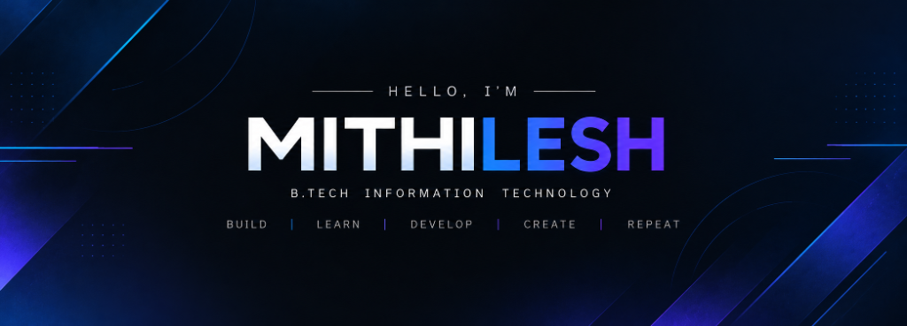

<!-- HERO BANNER -->

 
 

# Hi, I'm Mithilesh 👋

<!-- ANIMATED TYPING SUBHEADING -->

  <b>Information Technology Student • AI/ML Builder • Cybersecurity Enthusiast • Full-Stack Engineer</b>

<!-- SOCIAL & CONTACT BADGES -->

  
  
  
  
  
  <!-- ADD LINK: Resume -->
  <a href="# <!-- ADD LINK: Resume -->">
    
  </a>

---

## 👨‍💻 About Me

I am a **B.Tech Information Technology** student at **Sri Sairam Engineering College**, passionate about designing and building intelligent, secure, and production-ready digital products. 

My work sits at the intersection of **Applied AI/ML**, **Cybersecurity**, and **Full-Stack Engineering**. Whether it's training machine learning models for phishing and threat detection, building edge-AI hardware systems for industrial safety, or architecting responsive web and mobile applications with React and Flutter, I focus on turning complex challenges into clean, practical solutions.

- 💡 Passionate about **threat intelligence, computer vision, and edge computing**.
- 🛠️ Active participant in **hackathons, technical symposiums, and real-world project builds**.
- 🤝 Always excited to collaborate on **innovative software systems, open-source tools, and research ideas**.

---

## ⚡ Quick Facts

| Category | Details |
| :--- | :--- |
| 🎓 **Education** | B.Tech in Information Technology — Sri Sairam Engineering College |
| 📍 **Location** | Chennai, Tamil Nadu, India |
| ⏳ **Graduation** | Expected 2028 |
| 🎯 **Current Focus** | Full-Stack Engineering • Applied AI/ML • Threat Intelligence |
| 💡 **Key Interests** | Phishing Detection, Edge AI & IoT, Mobile Architecture (Flutter), UI/UX |
| 🌐 **IEEE Leadership** | **Secretary** — IEEE Computer Society • **Secretary** — IEEE-HKN |
| 🏆 **Top Achievements** | 1st Prize @ FAISCA 2026 • IET Smart City Finalist • Winner @ B2G & MIT TECHSCRIBE |

---

## 🎯 Currently Building

- 🛡️ **AI-Powered Threat Intelligence**: Advancing automated phishing and malicious URL classification pipelines.
- 📱 **Modern Cross-Platform Apps**: Building Flutter mobile apps paired with high-performance Spring Boot and FastAPI backends.
- 🧠 **Edge-AI Multi-Hazard Systems**: Combining IoT sensor arrays (ESP32-CAM, gas, thermal) with computer vision for real-time risk alerts.
- 🚀 **Hackathon Prototypes**: Engineering fast, scalable MVPs addressing civic safety, healthcare telerehabilitation, and diagnostic intelligence.

---

## 🛠️ Tech Stack

### 💻 Programming Languages

  
  
  
  
  
  
  
  
  
  
  

### 🌐 Frontend & Mobile Development

  
  
  
  
  
  

### ⚙️ Backend & API Development

  
  
  
  
  
  
  

### 🧠 AI, Machine Learning & Vision

  
  
  
  
  
  
  
  
  

### ⚡ IoT, Hardware & Edge Computing

  
  
  
  
  

### 🗄️ Databases & Cloud Backend

  
  
  
  
  
  
  

### 🛡️ Cybersecurity & AI Defense

  
  
  
  
  
  

### 🔧 DevOps & Tools

  
  
  
  
  
  
  
  
  
  

---

## 🚀 Featured Projects

  
<i>A curated selection of technical systems, AI applications, and engineering projects I've built.</i>

| Project | Description | Core Stack | Links |
| :--- | :--- | :--- | :---: |
| **🛡️ CyberNeura** | **AI-Powered Phishing & Malicious URL Detection Platform** • Real-time URL threat intelligence and deceptive domain heuristic analysis. • NLP-driven email body content inspection for targeted phishing detection. • Fast REST API architecture for instantaneous threat verdicts. | `FastAPI` `React` `Supabase` `NLP` `scikit-learn` `Python` | [Repository](https://github.com/mithi2704/CyberNeura) |
| **🏛️ MEDAL** | **Smart Civic Issue Reporting Platform** • Enables citizens to report public issues with geo-tagged images and real-time location. • AI-powered issue classification and automated triaging using YOLO. • Equips city officials with analytics dashboards to track, inspect, and resolve complaints efficiently. | `Flutter` `FastAPI` `PostgreSQL` `Supabase` `YOLO` `MinIO` `JWT` `Docker` | [Repository](https://github.com/mithi2704/MEDAL) |
| **🚨 SafeSmart / SafeZone AI** | **Edge-AI Multi-Hazard Industrial & Environmental Safety System** • Sensor-fusion telemetry combining toxic gas (MQ2), thermal (DHT22), and motion (PIR). • Computer vision on ESP32-CAM for visual hazard and intrusion identification. • Edge computing for sub-second alert triggers and offline operation. | `ESP32-CAM` `DHT22` `MQ2` `PIR` `Edge AI` `OpenCV` `IoT` | <!-- ADD PROJECT LINK: SafeSmart --> [Repository](#) |
| **🦾 RehaSense** | **AI-Assisted Telerehabilitation System for Stroke Recovery** • Real-time computer vision pose estimation for physical therapy exercise tracking. • Angle precision feedback and automated patient progress telemetry. • Accessible web dashboard bridging clinicians and recovering patients. | `Python` `OpenCV` `MediaPipe` `React` `FastAPI` `AI/ML` | <!-- ADD PROJECT LINK: RehaSense --> [Repository](#) |

---

## 📊 GitHub Statistics

  

---

## 🏆 Achievements & Recognitions

- 🌟 **Finalist** — *IET Smart City Challenge 2025*
- 🥇 **Winner** — *B2G Mini Hackathon*
- 🥇 **Winner** — *MIT TECHSCRIBE Paper Presentation*
- 🥇 **Winner** — *FAISCA 2026 Paper & Project Presentation*
- 🏅 **Top 10 Finalist** — *St. Joseph's National Level Hackathon*
- 🏅 **Top 15 Finalist** — *VIT Hackathon*

---

## 🌐 IEEE & Community Leadership

- **IEEE Computer Society** — *Secretary*
  - Spearheading technical initiatives, organizing coding symposiums, hackathons, and hands-on workshops at Sri Sairam Engineering College.
  - Directing technical documentation, coordinating executive committees, and managing student engagement.

- **IEEE-HKN (Eta Kappa Nu)** — *Secretary*
  - Leading chapter operations, technical mentorship sessions, and academic excellence programs honoring dedicated engineering students.
  - Managing executive communication, event planning, and cross-departmental collaborations.

---

## 💼 Experience

### 🏢 Maestrominds
**Web Development Intern**  
*June 2026 – July 2026*
- Developed **TRAXA** — a comprehensive GST & MCA operations management platform featuring automated task allocation, GPS-verified attendance logging, employee performance telemetry, and granular Role-Based Access Control (RBAC).
- Integrated cross-platform frontends (Flutter & React) with a robust backend powered by Node.js, TypeScript, PostgreSQL, and Prisma ORM.
- Engineered secure REST APIs, implemented JWT-based authentication, cloud media storage pipelines, and assisted with production deployment and debugging.

### 🏢 Central Institute of Tool Design (CITD) — *Guindy, Chennai*
**Intern — Embedded Systems & IoT**  
*25 June 2025 – 9 July 2025*
- Gained hands-on experience in microcontroller interfacing, IoT sensor calibration, and embedded C/C++ programming using the Arduino ecosystem.
- Designed and validated sensor integration circuits for real-time telemetry tracking and industrial hardware automation.

---

## 📚 Currently Learning

- 🧩 **Advanced Data Structures & Algorithms** (Targeted problem solving and algorithmic optimization)
- 🏗️ **Distributed Systems & Backend Architecture** (High-throughput APIs, caching, and scalable microservices)
- 👁️ **Computer Vision & Deep Learning Pipelines** (YOLOv8 custom dataset training and pose estimation)
- 🔐 **Applied Offensive & Defensive AI Security** (Threat modeling, adversarial ML, and API penetration testing)
- 🤖 **Autonomous AI Agent Architectures** (Tool-calling workflows and agentic LLM orchestration)

---

## 🤝 Open to Collaborate On

- 💡 **AI / ML & Computer Vision Applications**
- 🛡️ **Cybersecurity Tools & Malicious URL / Phishing Detection Engines**
- 📱 **Full-Stack Web & Cross-Platform Flutter Mobile Apps**
- ⚡ **Competitive Hackathons & High-Impact Open Source Initiatives**

---

## 💻 Coding Profiles

  
  
  

---

## 📬 Let's Connect

  
  
  
  
  

---

### *"Turning ideas into working software 🚀"*

  <i>Building. Learning. Experimenting. Repeating.</i>

